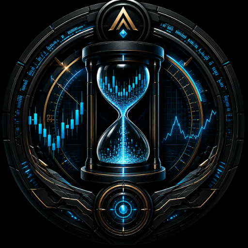

<p align="center">
  <a href="https://play.google.com/">
    
  </a>
</p>

# Axiom Chronos Vector

> **Know the Data. Know the Risk. Know the Truth.**

Axiom Chronos Vector is a **native Android application for vectorized financial market backtesting**, built entirely in Kotlin and designed to run its computational workload directly on the user's device.

The only network dependency is the on-demand retrieval of public market data. Strategy computation, analysis, caching and results remain local to the device.

## Data & Privacy

Chronos is designed as a standalone, privacy-first research tool.

- **No registration**
- **No user accounts**
- **No telemetry or data tracking**
- **No strategy or trade data sent to the cloud**
- **No live exchange-account connectivity**
- Downloaded market vectors use session-scoped local caching and are automatically purged when the active session is cleared or the application exits

Market data is retrieved from external public providers when requested. Chronos does not claim that third-party datasets are inherently complete or perfect. Instead, the received dataset is audited by the Integrity Engine before the backtest results are presented.

## What It Is

Most backtesting environments either run remotely or depend on a desktop Python ecosystem. Chronos takes a different approach: it is a self-contained mobile research environment that performs the complete workflow — from market-data ingestion through execution simulation and quantitative analysis — on the Android device.

Its execution model is **vectorized rather than traditionally event-driven**. Signal generation and risk-rule application operate across price vectors, following principles inspired by Python's `vectorbt` while being rebuilt natively for Kotlin/JVM.

## What It Does

### Backtesting Engine

- Vectorized simulation of entries, exits, fees and slippage
- Long and short positions
- Trend-regime-based position logic
- Stop Loss and Take Profit
- Volatility-adjusted ATR Trailing Stops where supported
- Simulated margin-call / liquidation logic

### Market Data

- **Crypto:** Binance public OHLCV data
- **Stocks & Commodities:** Yahoo Finance market data
- Multi-year historical datasets where supported by the underlying provider
- Session-scoped local caching for iterative testing

### Strategy Library

Chronos currently provides technical strategy components including:

- EMA Cross
- MACD
- RSI
- ADX
- Bollinger Breakouts
- Money Flow Index (MFI)
- 200-period EMA regime filtering

The available indicators are presented through market-specific selection interfaces and grouped according to their intended analytical role.

## Quantitative Intelligence

Chronos goes beyond a simple profit/loss figure and calculates a broader performance matrix, including:

- Sharpe Ratio
- Sortino Ratio
- Calmar Ratio
- Profit Factor
- Expectancy
- Kelly Criterion
- Tactical Alpha
- Beta
- Pearson Correlation

### Alpha & Beta

Chronos uses **Ordinary Least Squares (OLS) regression** to calculate Tactical Alpha and Beta against a selected benchmark or market proxy.

Beta measures the strategy's sensitivity to the benchmark. Alpha represents the regression-derived return remaining after accounting for that benchmark exposure.

Pearson correlation is calculated separately to quantify the linear relationship between strategy and benchmark returns.

## Probability Cloud & Sequence Risk

Historical trades can produce very different equity paths depending on their order.

Chronos uses Monte Carlo trade-sequence reshuffling to generate a **Probability Cloud**, allowing users to examine sequence risk and the range of possible equity paths produced by the same historical trade outcomes.

The purpose is not to make a backtest look more impressive. It is to expose how dependent a result may be on the order in which its historical trades occurred.

## Intellectual Honesty & Data Integrity

Every backtest passes through an **Integrity Engine before results are presented**.

Chronos checks for:

- Missing candles
- Timestamp gaps
- Duplicate candles
- Data-quality degradation around gaps
- Local volatility surrounding missing-data periods
- Sample-size limitations
- Session completeness where applicable

Missing data occurring during higher-volatility periods can receive a greater penalty than gaps during quieter periods. The resulting **Axiom Result Validity** rating ranges from **High** to **Moderate**, **Low**, or **Untrustworthy**.

This is a deliberate part of the product philosophy:

> **If the data has a problem, Chronos reports the problem.**

## Market Modules

### Crypto

The Crypto module uses Binance OHLCV data and supports multi-year historical backtesting with technical strategies including EMA Cross, MACD, RSI, Stochastic and Bollinger-based volatility logic, together with 200-EMA regime filtering.

### Stocks & ETFs

The Stock Intelligence module provides benchmark-relative analysis and regular-session controls. It includes EMA Crossover, Money Flow Index and Keltner Channels, together with Alpha/Beta and benchmark analysis.

### Commodities

The Commodity module is session-aware and designed around the distinctive time and volatility characteristics of physical-asset markets. It includes ADX Trend, ROC Momentum, ATR Breakout, ATR trailing stops, Seasonal Deviation, Seasonal Ghost Curve visualization and DXY correlation context.

Chronos currently treats commodity data as technical research vectors. It does not model physical storage, delivery schedules, weather, crop reports, mining disruptions, or futures roll effects such as contango and backwardation.

## On-Device Performance

Chronos is designed to make substantial vector processing practical on modern Android hardware.

A representative Crypto workload processed approximately **17,500 one-hour candles representing two years of data in under 100 ms**, with a memory footprint of approximately **1.1 MB per two-year spot vector**.

The architecture is modular Kotlin and remains open to future lower-level performance optimization.

## Data Integrity Example

A 10-year BTCUSDT dataset on the 15-minute timeframe provided a useful example of why dataset auditing matters.

Chronos reported:

- **315,187 candles received**
- **621 missing candles**
- **Longest gap: 134 bars**
- **Data quality: 99.80%**
- **Result validity: High confidence**

The purpose of exposing these figures is straightforward: the user can see the condition of the data underlying the backtest rather than having to assume that the historical dataset was flawless.

## Reporting

Chronos provides a full trade-execution record and supports local export, including native PDF report generation saved to the device's Downloads location.

## What Chronos Does Not Do

Chronos is a **research and simulation environment**, not an execution platform.

It does **not**:

- Execute live trades
- Connect to brokerage or exchange trading accounts
- Manage real-money wallets
- Predict future prices
- Guarantee future performance
- Provide investment advice

The current Kotlin engine is also **not yet benchmarked trade-for-trade against a reference `vectorbt` implementation**. That comparison remains part of the validation process so that behavioral matches and divergences can be identified rather than assumed away.

## Architecture

Chronos follows an MVVM structure with a Clean Architecture separation around the computational core:

```text
UI / Jetpack Compose
        ↓
LaboratoryViewModel
        ↓
Data Providers → Integrity Engine
        ↓
Vectorized Execution Engine
        ↓
Metrics & Quantitative Intelligence
        ↓
Probability Cloud / Results
```

Core packages include:

- `core.data` — Binance/Yahoo market-data provider abstraction
- `core.engine` — vectorized execution and quantitative metrics
- `core.integrity` — data auditing and validation
- `core.export` — native PDF reporting

For deeper implementation details, see **[Specs.md](Specs.md)**.

## Technology Stack

- **Kotlin 2.0+**
- **Jetpack Compose / Material 3**
- **Coroutines / StateFlow**
- **OkHttp**
- **MPAndroidChart**
- **Android 8.0+ (Min SDK 26)**
- **Android 15 (Target SDK 37)**

## Availability

Axiom Chronos Vector is currently in public testing and refinement, and the final release is not yet publicly available for download as a production ready application. 

By making the testing publicly available, it opens the doors for traders and analysts to test and validate the output logic, and provide real use-case insights into logic calibration and optimization. 

When the application becomes production read, it will be only distributed as an Android application directly through Google Play store.


---

> **Axiom Chronos Vector is a research instrument, not a trading oracle.**
>
> **Know the Data. Know the Risk. Know the Truth.**

*Compiled by Astra-Axiom Intelligence Systems.*
